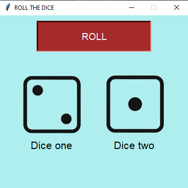

## Dice Rolling Application
This is a simple dice rolling application built using Python's Tkinter library. It simulates the rolling of two dice and displays the results visually.
### Features
- Click the "ROLL" button to roll two dice.
- Displays random dice images based on the rolled values.
- Provides labels to identify each die.

## OUTPUT


## Getting Started
### Prerequisites
- Python 3.x
- Tkinter library (usually included with Python installation)

### Installation
1- Clone the repository:
```
git Clone https://github.com/GashbeenHassan/Dice_Roller

```
2- Navigate into the project directory:
```
cd Dice_Roller

```
3- Run the application:
```
python Dice.py

```
## Usage
- Click the "ROLL" button to roll the dice and see the results.

## Contributing
Contributions are welcome! Please feel free to fork the repository and submit pull requests.

## License
This project is licensed under the MIT License 
